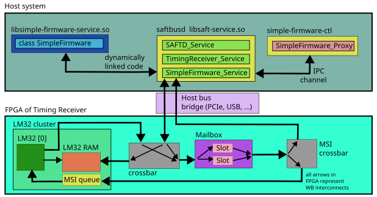

# SimpleFirmware an instructive example of how to write an LM32 firmware driver plugin for saftlib

Saftlib version 3 introduces the possibility to extend the functionality of a running saftlib daemon
during runtime by loading shared objects as plugins. 
This can be used to adapt the daemon to a change of LM32 firmware without stopping all other saftlib services.
This is a representative example of a combination of LM32 firmware saftlib driver and command line tool to interact with the system.

## Overview

This example is built with GNU autotools. 
The firmware can be compiled if an appropriate tool chain is available, but a precompiled firmware binary is part of the repository.
The firmware binary is installed together with the plugin and loaded into the LM32 in the constructor of the driver class.
The following picture shows how the components work together



Writing an LM32 firmware driver typically involve these steps:
  - Derive a class from `saftlib::TimingReceiverAddon` and implement the `getObjects` method.
  - Implement the functionality of the driver class (whatever that may be). If the driver class needs access to the TimingReceiver driver object and or the SAFTd driver object, declare the constructor of the driver class with pointers to these objects as parameters. 
  - Implement a create_services function. This function is called whenever the plugin is loaded by the saftbus daemon. This function should do the following:
    - Get a pointer to a TimingReceiver driver object.
    - Create an instance of your driver class and manage the memory with a std::unique_pointer.
    - Pass ownership of the memory to the TimingReceiver with the `installAddon` method.
    - Create an instance of the service class (automatically created from the driver class declaration).
    - Install the service under a new object path in the saftbus Container by calling `create_object` method.


## Firmware 

The firmware in this example waits for MSIs in an endless loop. When an MSI arrives, it reacts by 
sending another MSI back to the host system.

## Driver code walk through

### Header file [SimpleFirmware.hpp](src/SimpleFirmware.hpp)
The required saftlib headers are 
```C++
#include <SAFTd.hpp>
#include <TimingReceiver.hpp>
#include <TimingReceiverAddon.hpp>
#include <sigc++/sigc++.h>
```
The driver class needs a few members variables:
  - Its own object path.
  - A pointer to the SAFTd driver object in order to request and release MSI callbacks.
  - A pointer to the TimingReceiver driver object where this class is registered as add-on.
  - Source handles are needed to remove the TimeoutSources in the SimpleFirmware destructor.
  - Instances of Mailbox::Slot objects which represent the configured Mailbox slots.
  - The MSI address of the registered callback
  - A counter which is sent as data value of the MSI

There is one member function `send_msi_to_hw` that will send an MSI to the hardware (LM32 CPU).
One member function `receive_hw_mse` to be registered as callback for MSI coming from the hardware (LM32 CPU).
A constructor, which will halt the CPU, load the firmware binary into the CPU RAM, and reset the LM32 CPU.
In addition, the constructor will configure the Mailbox slots used by host as well as by the firmware.
The function `getObjects` is an abstract member function of `TimingReceiverAddon` and it must return information about the provided services (interface name, object name and object path) provided by this add-on .

The only two parts of the interface that are tagged with `// @saftbus-export` is the signal that is emitted when an MSI is received from the hardware, and the `start` method, which creates a periodic TimeoutSource which will call `send_msi_to_hw` every 100 ms. 
```C++
namespace saftlib {
	class SimpleFirmware : public TimingReceiverAddon
	{
		std::string object_path;
		saftlib::SAFTd *saftd;
		saftlib::TimingReceiver *tr;
		std::vector<saftbus::SourceHandle> timeout_sources;

		/// Mailbox::Slot represents a configures Mailbox slot in hardware
		std::unique_ptr<saftlib::Mailbox::Slot> cpu_msi_slot;
		std::unique_ptr<saftlib::Mailbox::Slot> host_msi_slot;

		/// Remember the address from register_irq in the constructor so that it can be 
		/// released in the destructor
		eb_address_t msi_adr;

		/// This is just a counter that is incremented each time an MSI is sent to the LM32 firmware.
		/// The current value of cnt is sent as part of the MSI data.
		int cnt;

		/// @brief The function is called whenever an MSI from hardware to host has the address 
		/// retured by "request_irq".
		void receive_hw_msi(uint32_t value);
		bool send_msi_to_hw();
	public:
		SimpleFirmware(saftlib::SAFTd *sd, saftlib::TimingReceiver *tr);
		~SimpleFirmware();

		/// @brief This is used by the TimingReceiver object that this Driver class is attached
		/// to register the service.
	    std::string getObjectPath();

		/// This function must be implemented by all TimingReceiverAddon classes so that the TimingReceiver
		/// service can report information (interface name, object name, object_path) about this child 
		/// service to users.
		std::map< std::string , std::map< std::string, std::string > > getObjects();

		/// @brief Each call to this function will cause send_msi_to_hw() to be called every 100 ms. 
		/// Successive calls to this functions will add ever more periodic calls.
	    // @saftbus-export
	    void start();

	    /// @brief This will be emitted when an MSI from the hardware arrives 
	    /// (i.e. the callback function receive_hw_msi is called)
	    /// Users of the class (or the corresponding Proxy class) can connect to this signal
	    /// in order to receive the MSIs.
	    // @saftbus-export
	    sigc::signal<void, uint32_t> MSI;
	};
}
```

### Implementation [SimpleFirmware.cpp](src/SimpleFirmware.cpp)
#### Constructor
The constructor 
  - halts the CPU
  - copies the firmware binary into the RAM
  - resets the CPU.
```C++
SimpleFirmware::SimpleFirmware(saftlib::SAFTd *sd, saftlib::TimingReceiver *timing_receiver)
	: saftd(sd)
	, tr(timing_receiver)
{
	// stop the cpu, write firmware and reset cpu
	tr->SafeHaltCpu(0);
	std::string firmware_bin(DATADIR "/firmware.bin");
	tr->WriteFirmware(0, firmware_bin);
	tr->CpuReset(0);
```

Then a new object path for the service is created, by appending `/simple-fw` to the object path of the TimingReceiver.
```C++
	// make up an object path, since we are a child of a TimingReceiver our object_path should 
	// start with its object_path, appended by a fitting name for our driver
	object_path = tr->getObjectPath();
	object_path.append("/simple-fw");
```
Configuring the Mailbox is easier when a `Mailbox*` pointer is available (otherwise casting of `tr` pointer is required later).
Two Mailbox slots are configured
  - one that is targeted at the MSI queue of the LM32 cluster (the address for this is known and is `0x0`).
  - one that is targeted at the host system (the address for this is obtained from the `reqest_irq` function).
The two objects `cpu_msi_slot` and `host_msi_slot` are unique pointers and they will free the Mailbox resources on destruction.
```C++
	// In order to simplify the use of the Mailbox driver (from which TimingReceiver is derived)
	// create a Mailbox pointer.
	saftlib::Mailbox *mbox = static_cast<saftlib::Mailbox*>(tr);
	// This is the (fixed) MSI-slave address of the LM32 cluster. 
	// It cannot be read from the hardware (but is known for any given hardware)
	const uint32_t CPU_MSI=0x0; 
	// Since Mailbox is an MsiDevice (i.e. an MSI master), it can be used to call 
	// SAFTd->request_irq. Any MSI with the address equal to "msi_adr" will now be 
	// redirected the the connected callback function "receive_hw_msi"
	msi_adr = saftd->request_irq(*mbox, std::bind(&SimpleFirmware::receive_hw_msi,this, std::placeholders::_1));

	// configure one Mailbox slot with the CPU_MSI address
	cpu_msi_slot  = mbox->ConfigureSlot(CPU_MSI);
	// configuer another Mailbox slot with the address returned by request_irq, 
	// which is now associated with callback "receive_hw_msi"
	host_msi_slot = mbox->ConfigureSlot(msi_adr);

	// std::cerr << "cpu_msi_slot index " << cpu_msi_slot->getIndex() << std::endl;
	// std::cerr << "host_msi_slot index " << host_msi_slot->getIndex() << std::endl;

	cnt = 0;
}
```
The destructor will remove all registerd TimoutSources and releases the `msi_adr`.
```C++
SimpleFirmware::~SimpleFirmware()
{
	// Remove all TimoutSources from the event loop.
	for (auto &source: timeout_sources) {
		saftbus::Loop::get_default().remove(source);
	}
	// Release_irq allows the MSI address to be reused by another driver.
	saftd->release_irq(msi_adr);
}
```
The MSI callback function does nothing but emitting a signal.
This signal is labeled as `// @saftbus-export`, therefore the signal will be redirected to proxy objects.
```C++
void SimpleFirmware::receive_hw_msi(uint32_t value)
{
	// Just send a signal to whoever is connected to it.
	// If this Driver class runs in a saftbus-daemon, the signal will be
	// redirected over saftbus to SimpleFirmware_Proxy objects.
	MSI.emit(value);
}
```
This function uses the Mailbox slot to send an MSI to the LM32 CPU.
Returning `true` will keep the TimoutSource active and the function will be called periodically.
```C++
// send an MSI to the LM32 cluster
bool SimpleFirmware::send_msi_to_hw()
{
	// keep track of the number of send MSIs (cnt) in order to see if they arrive ( in the correct order)
	std::cerr << "triggerMSI: " << ++cnt << std::endl;
	// Use the Mailbox::Slot. The use function will cause the Mailbox to send an MSI
	// with the pre-configured address and data equal to the argument of Use(<data>).
	// In this case the pre-configured address targets the LM32-cluster.
	cpu_msi_slot->Use((host_msi_slot->getIndex()<<16)|cnt);
	// returning true here means that the TimeoutSource is not disconnected hereafter.
	return true;
}
```
This function registers a periodic TimeoutSource.
```C++
void SimpleFirmware::start() {
	// register a periodic TimeoutSouce to call "send_msi_to_hw" every 100 ms
	timeout_sources.push_back(saftbus::Loop::get_default().connect<saftbus::TimeoutSource>(
			std::bind(&SimpleFirmware::send_msi_to_hw, this), std::chrono::milliseconds(100), std::chrono::milliseconds(100)
		));
}
std::string SimpleFirmware::getObjectPath() {
	return object_path;
}
```
The `getObjects` function has to return a map interface names, where for each interface there is a map of object names and object paths for these objects.
There is no limit on how many services a plugin can register. In this case it is only one service object. The interface name is typically the name of the driver class. The name is more or less arbitrary, but usually it is the same string that is appended to the object path of the parent object (the TimingReceiver in this case).
```C++
std::map< std::string, std::map< std::string, std::string> > SimpleFirmware::getObjects()
{
	std::map< std::string, std::map< std::string, std::string> > result;
	result["SimpleFirmware"]["simple-fw"] = object_path;
	return result;
}
```


### Plugin entry code [create_services.cpp](src/create_services.cpp)

The entry code must provide a function named `create_services` with C linkage.
It is called with a `saftbus::Container` and string arguments.

In this case, the arguments are the names of the TimingReceivers to which a SimpleFirmware driver should be attached.
The code does the following:
  - Obtain a pointer to a SAFTd_Service (the object path for SAFTd service is always the same).
  - Extract the SAFTd driver object from it.
```C++
std::map<std::string, std::unique_ptr<saftlib::SimpleFirmware> > simple_fw;

extern "C" 
void create_services(saftbus::Container *container, const std::vector<std::string> &args) {
	std::cerr << "create_services args : ";
	for(auto &arg: args) {
		std::cerr << arg << " ";
	}
	std::cerr << std::endl;
	std::string object_path = "/de/gsi/saftlib";
	saftlib::SAFTd_Service *saftd_service = dynamic_cast<saftlib::SAFTd_Service*>(container->get_object(object_path));
	saftlib::SAFTd *saftd = saftd_service->d;
```
Then for all requested timing receivers:
  - Obtain a pointer to the TimingReceiver_Service object.
  - Extract the TimingReceiver driver object.
  - Create a new SimpleFirmware driver instance (as a unique_ptr).
  - Remember a bare pointer to the newly created object.
  - Transfer ownership of the object to the TimingReceiver by calling `installAddon`.
  - Create and SimpleFimware_Service instance and install it in the `saftbus::Container` (`container`) under the correct object path.
```C++
	for(auto &device: args) {
		std::cerr << "install simple-fw for " << device << std::endl;
		std::string device_object_path = object_path;
		device_object_path.append("/");
		device_object_path.append(device);
		saftlib::TimingReceiver_Service *tr_service = dynamic_cast<saftlib::TimingReceiver_Service*>(container->get_object(device_object_path));
		saftlib::TimingReceiver *tr = tr_service->d;

		std::unique_ptr<saftlib::SimpleFirmware> simple_fw(new saftlib::SimpleFirmware(saftd, tr));
		saftlib::SimpleFirmware *simple_fw_ptr = simple_fw.get();

		tr->installAddon("SimpleFirmware", std::move(simple_fw));
		container->create_object(simple_fw_ptr->getObjectPath(), std::move(std::unique_ptr<saftlib::SimpleFirmware_Service>(new saftlib::SimpleFirmware_Service(simple_fw_ptr, std::bind(&saftlib::TimingReceiver::removeAddon, tr, "SimpleFirmware") ))));
	}
}
```