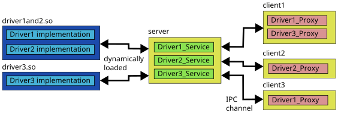
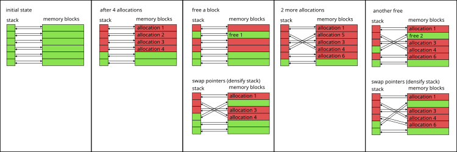

# Saftbus: an interprocess communication library

## Features
  - A program [saftbusd](src/saftbusd.cpp) that can be run in the background (daemon) and provides services which can be accessed through a UNIX domain socket by Proxy objects.
  - New services can be added by loading plugins at startup or during runtime of the daemon
  - A code generator that facilitates developments of plugins for the daemon
  - A command line tool [saftbus-ctl](src/saftbus-ctl.cpp) to control the daemon, e.g. load/unload new plugins or remove service objects
  - A deterministic memory allocator for real time applications

## Architecture overview



A server process provides an inter process communication (IPC) channel (a UNIX domain socket) over which client processes can connect.
At startup or at runtime, shared objects can be loaded by the server (plugins). 
These plugins contain C++ classes (driver classes) that are supposed to be shared resources, an should be accessible by all connected client processes.
The plugins also contain automatically generated Service and Proxy classes with boilerplate code for the IPC data transfer.
Instances of the Service classes are managed by the server. Client programs use instances of Proxy classes to access methods, properties, and signals provided by the driver classes. 

The program [saftbusd](src/saftbusd.cpp) is a simple implementation of such a server and is installed together with the saftbus library.
It is also possible to develop a different server by using saftbus library components. 
The program [saftbus-gen](../saftbus-gen/README.md) can be used to generate the Proxy and Service classes from a given driver class declaration. 
Driver classes are ordinary C++ classes. 


## History

[saftlib](../saftlib/README.md) was originally written with [D-Bus](https://www.freedesktop.org/wiki/Software/dbus/) for inter process communication.
D-Bus was later replaced with a more real-time friendly system called saftbus.
Initially, the saftbus API was identical to the D-Bus API ([Gio::Dbus](https://developer-old.gnome.org/glibmm/stable/namespaceGio_1_1DBus.html)) to avoid code changes in the rest of saftlib.
Now, saftbus is re-written from scratch with a new API, and the rest of saftlib was changed to work with the new API.
The re-written version of saftbus still shares some properties with D-Bus:
  - A daemon running in the background maintains a list of available services.
  - Services offer an interface which consists of functions, properties (setter/getter functions), and signals.
  - Multiple processes can share services and use the provided interface.

Many aspects are different from D-Bus. The most important being:
  - Services cannot be added by processes connecting to the daemon but have to be added by dynamically loading a plugin (shared library) into the daemon.
  - Services are only usable if the signature of the interface is known. Introspection is not possible.


## Environment variables 
  - `SAFTBUS_SOCKET_PATH` : determines the location of the UNIX domain socket in the file system. Default ist `/var/run/saftbus/saftbus`
  - `SAFTD_ALLOCATOR_CONFIG` : set the configuration of the deterministic memory allocator. Default value is "16384.128 1024.1024 64.16384" (see below for the meaning of the numbers)

## Startup 
Run the saftbusd executable.
In case of an error such as `cannot create socket directory: /var/run/saftbus`, try to run with root privileges or set the `SAFTBUS_SOCKET_PATH` environment variable to a location where the socket can be created (e.g. `/tmp/saftbus`)
If saftbusd was run without arguments, there will be no services apart from the saftbus::Container.
Additional services can be added by loading saftbus-plugins, e.g `saftbus-ctl -l libsaftd-service.so tr0:dev/wbm0`.
Alternatively, plugins can be loaded at startup by passing them as command line arguments to the saftbusd executable (e.g. `saftbusd libsaftd-service.so tr0:dev/wbm0`).

### Deterministic memory allocator

Three versions of the saftbusd binary are distributed:
  - `saftbusd` contains a configurable deterministic global memory allocator. It manages memory blocks of a given size and given number. The number of blocks and their size can be configured using the SAFTD_ALLOCATOR_CONFIG environment variable. The default configuration is "16384.128 1024.1024 64.16384" which means
    - 16384 blocks of size 128 bytes
    - 1024 blocks of size 1024 bytes
    - 64 blocks of size 16384 bytes
  Allocations larger than the larges block size fall back to the default heap allocator.
  Number of blocks must strictly decrease. block size must strictly increase.
  This is intended for real time critical applications.
  - `saftbusd-srta` contains a simpler non-configurable deterministic memory allocator with hard coded block sizes.
  - `saftbusd-norta` uses standard heap allocations

Details on the allocator implementation are described [here](#allocator-implementation)

## Saftbus plugins
Typical use case is to run saftbusd and load a custom plugin to provide custom services, and use custom programs that communicate with the services provided by the plugin using proxy classes. See below for a simple example. 
### Services
  - A saftbus service encapsulates an instance of a driver class.
  - It handles the inter process communication data and translates it into function calls that are redirected to the driver instance. The result is sent back to the calling process.
  - All services are managed by the saftbus::Container class, using a unique string called "object path".
  - Calling `saftbus-ctl -s` list all managed services on the `saftbus::Container`.
  - The source code of the service class is (typically) generated from a Driver class using the `saftbus-gen` tool, which extracts the signatures of all annotated methods and signals. 
  - An instance of a service class needs to be constructed with a pointer to an instance of the corresponding driver class from which it was generated. 
### Driver classes
  - Are normal C++ classes, there are no restrictions on how a driver class can be written. 
  - Must not be defined in the global scope (`saftbus-gen` doesn't support this yet). 
  - Inheritance is explicitly allowed. 
  - Methods and signals of the driver class which are supposed to be usable from different processes (through a Proxy object) need to be annotated with the `// @saftbus-export` comment. 
### Proxy classes
  - Are generated from the definition of the Driver class, just like Service classes.
  - Have all methods and signals that were annotated with the `// @saftbus-export` comment in the Driver class.
  - Proxy objects (instances of Proxy classes) can be used in any program to access the corresponding Service through saftbus. 
  - Proxy classes are constructed using the object path of the service in the `saftbus::Container`. 
  - Multiple Proxy instances can share the same Service instance. 
  - If a Service emits a signal, all Proxy instances will receive it.
### Entry function
  - Each plugin needs an export "C" function with name `create_services`.
  - The function receives a pointer to a `saftbus::Container` and a vector of strings (arguments).
  - It can add service objects to the container by providing an object path and a unique_ptr of the Service class.
  - The Memory of the Driver class must be managed by the `create_services` function
  - A destruction callback can be registered with the service object, which gets called if the service is removed from the `saftbus::Container`

### A very simple example plugin (examples/ex00)
#### Driver class
The driver class has a random number generator for integers in the range [1..6]. It is called "Dice". Dice_Proxies can create a random number using the method "Throw". The result is communicated using the signal "Result". All Dice_Proxies with a connected callback function will be notified when a new number was generated.
```C++
#ifndef EX00_DICE_HPP
#define EX00_DICE_HPP
#include <sigc++/sigc++.h>
#include <functional>
namespace ex00 {
  class Dice {
  public:
    // @saftbus-export
    void Throw();
    // @saftbus-export
    sigc::signal<void, int> SigResult;
    // @saftbus-export
    std::function<void(int result)> FunResult;
  };
}

#endif
```
The definition of the Throw method is in Dice.cpp:
```C++
#include "Dice.hpp"
#include <cstdlib>
namespace ex00 {
  void Dice::Throw() {
    int number = rand()%6+1;
    SigResult.emit(number);
    FunResult(number);
  }
}
```
Four source files (Dice_Service.hpp, Dice_Service.cpp, Dice_Proxy.hpp, Dice_Proxy.cpp) will be generated with the following call to the `saftbus-gen` tool:

    saftbus-gen -o Dice.hpp

The method Dice::Throw and the signal Result will be identified by `saftbus-gen` and added to the Dice_Proxy interface. 
#### Entry point for the plugin
The file create_services.cpp contains the create_services function, which is called when the plugin is loaded by saftbusd.
In this case, one argument is expected which specifies the object path of the created Dice_Service instance.
Optionally, a destruction callback can be attached to the Service. This is called whenever the service is removed, (e.g. someone calling `saftbus-ctl -r <object-path>`). 
In this case the Driver instance is destroyed by the callback function so that the plugin can be safely removed (`saftbus-ctl -u libsaftbus-ex00-service.lo`). 
If the plugin is removed when there are still active services created by it, the result will be a crash of saftbusd. 
```C++
#include "Dice.hpp"
#include "Dice_Service.hpp"
#include <saftbus/error.hpp>
#include <vector>
#include <string>

std::unique_ptr<ex00::Dice> dice;

void destroy_callback() {
  dice.reset();
}

extern "C" 
void create_services(saftbus::Container *container, const std::vector<std::string> &args) {
  if (args.size() == 1 && !dice) {
    dice = std::unique_ptr<ex00::Dice>(new ex00::Dice);
    container->create_object(args[0], 
      std::unique_ptr<ex00::Dice_Service>(new ex00::Dice_Service(dice.get(), destroy_callback))
    );
  } else {
    throw saftbus::Error(saftbus::Error::INVALID_ARGS, "need object path as argument");
  }
}

```
All Service classes and the create_services function are compiled into a share library (the plugin that will be loaded by saftbusd)
All Proxy classes are compiled into another library that other programs can use to create Proxy objects to utilize the Service objects in saftbusd. 
#### Utilize the Driver_Proxy
Programs instantiate a Dice_Proxy object and use it in the very same way as an instance of the Dice driver class would be used.
A program which can be used for both, listen to Result as well as initiate a Throw, could look like this:
```C++
#include "Dice_Proxy.hpp"
#include <saftbus/client.hpp>
#include <sigc++/sigc++.h> 
#include <functional> 
#include <string>

std::string cmd, object_path;
void print_result_sig(int result) {
  std::cout << "dice " << object_path << " was thrown. SigResult = " << result << std::endl;
}
void print_result_fun(int result) {
  std::cout << "dice " << object_path << " was thrown. FunResult = " << result << std::endl;
}
int main(int argc, char *argv[]) {
  if (argc != 3) {
    std::cout << "usage: " << argv[0] << " <object-path> throw|listen" << std::endl;
    return 1;
  }
  object_path = argv[1];
  cmd         = argv[2];

  auto dice = ex00::Dice_Proxy::create(object_path);

  dice->SigResult.connect(sigc::ptr_fun(print_result_sig));
  dice->FunResult = &print_result_fun;
  if (cmd == "throw") {
    dice->Throw();
  }
  for (;;) {
    saftbus::SignalGroup::get_global().wait_for_signal();
    if (cmd != "listen") break;
  }
  return 0;
}
```

After launching the saftbusd with the newly created library as argument arguments of the ceate_services function must appear directly behind the shared object filename

    $ saftbusd libex00-service.so /my/dice

A call to `saftbus-ctl -s` should show the newly created Dice under the `/my/dice` object path, next to the Container interface under `/saftbus`:
All plugin shared object files and all connected client processes are listed as well:
```bash
$ saftbus-ctl -s
objects:
  object-path ID [owner] sig-fd/use-count interface-names
  /saftbus 1 [-1]  6/1 Container 
  /my/dice 2 [-1]  Dice 

active plugins: 
  libsaftbus-ex00-service.so

connected client processes:
  5 (pid=284490)
$
```
A dice throw can be initiated by calling 
```bash
$ ex00-ctl /my/dice throw
dice /my/dice was thrown. Result = 5
$ ex00-ctl /my/dice throw
dice /my/dice was thrown. Result = 4
$ ex00-ctl /my/dice throw
dice /my/dice was thrown. Result = 1
$
```
If other instances of ex00-ctl were launched before with the "/my/dice listen" arguments, they all would show the following:
```bash
$ ex00-ctl /my/dice listen
dice /my/dice was thrown. Result = 5
dice /my/dice was thrown. Result = 4
dice /my/dice was thrown. Result = 1
```


### Further information
A More complex examples which make use of inheritance and creation of nested services can be found under 
  - examples/ex01_dice.
  - examples/ex02_dice_cup.
  - the saftlib plugin [saftlib](../README.md)

More detailed documentation on how to write saftbus plugins can be found in the Doxygen Main Page (you may have to build it first by running doxygen)  


### Allocator implementation
Each allocator manages a fixed number of fixed size memory blocks and a stack.
Each stack position refers to a block and each block refers back to that stack position.
Allocations return the block where the last free stack position points to (runtime is O(1)).
A free operation can happen on any block, therefore pointers have to be swapped in order to remove the gaps in the stack (runtime is still O(1): always four indirections and two swap operations)
The following picture explains how it works (green is free, red is allocated).




